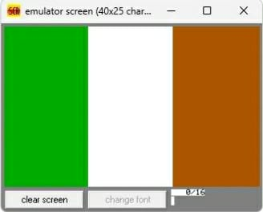

# Making the Italian flag in assembly language.
## About the project
โปรแกรมนี้เป็นส่วนหนึ่งของโปรเจกต์ในรายวิชา "การจัดองค์ประกอบและสถาปัตยกรรมคอมพิวเตอร์" เป้าหมายของโปรเจกต์นี้คือการประยุกต์ใช้ความรู้ด้านการทำงานของ CPU และหน่วยความจำ เพื่อสร้างการแสดงผลทางกราฟิกเป็น "ธงชาติอิตาลี" โดยใช้ภาษา Assembly บนสถาปัตยกรรม x86 (8086) ผ่านโปรแกรมจำลอง emu8086

## Features
- Direct Video Memory Access: การเข้าถึงหน่วยความจำวิดีโอโดยตรงที่แอดเดรส 0A000h
- Video Mode 13h: การใช้งานโหมดกราฟิกความละเอียด $320 \times 200$ พิกเซล
- Loop Optimization: การใช้ลูปเพื่อวาดแถบสีทั้ง 3 แถบ (เขียว, ขาว, ส้ม) อย่างมีประสิทธิภาพInterrupt 
- Handling: การเรียกใช้ INT 10h เพื่อจัดการการแสดงผลบนหน้าจอ

## How it works
- Initialize: เริ่มต้นการตั้งค่า Video Mode
- Color Mapping: การกำหนดค่าสี (Palette) ตามมาตรฐานธงชาติอิตาลี
Green (02h)
White (0Fh)
Orange (06h)
- Pixel Drawing: การคำนวณตำแหน่งพิกเซลในแนวตั้งและแนวนอนเพื่อแบ่งพื้นที่ 3 ส่วนเท่าๆ กัน
## Screenshots

## Installation & Usage
Compile and run using emu8086 emulator.
Press Emulate and then Run to see the output.
